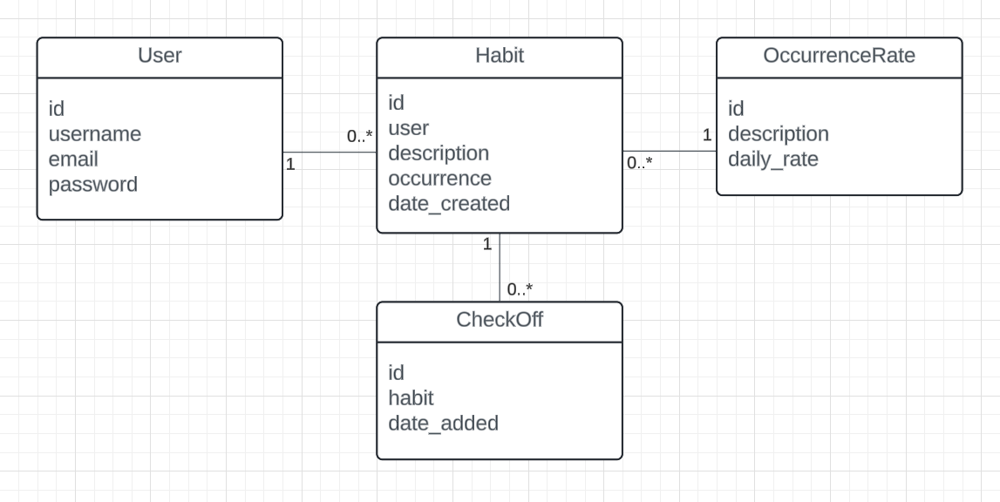

# HabitusX - Habit tracking application

## Project overview

This is a Django web application designed for tracking one's habits. The project follows Django's Model-View-Controller architecture pattern: here, views represent Django’s templates, while the controller logic is handled by Django’s class based and function based views.

In order to track habits, the project manages 4 domain entities, which have the relationships represented in the following UML class diagram.



## Local Setup, installation and run instructions

### 1 - Clone the repository

Clone the repository and cd into the main folder using the following commands:

```
git clone https://github.com/tommydemarco/habitusx.git
cd habitusx
```

### 2 - Create the virtual environment

It is recommended to run the project in a venv to manage dependencies.
You can find alternatives on how to create a virtual environment based on you machine specs online.

### 3 - Install the required dependencies

Once you have created and activate the virtual emnvironment, install the dependencies that are described in the file `requirements.txt` in the root folder.

### 4 - Database, data, and environment variables

This project was created for learning purposes, and it is not meant to be deployed.

Therefore, all variables that would normally be set as environment variables are simply hardcoded in the code.
For example, the value of the Django SECRET_KEY and the value of the DEBUG constant.

In addition, the database (SQLite) in its integrity has been committed to the repository along with the data it contains, and the instance is used when setting up and running the project locally.

### 5 - Run the development server

Once the virtual environment is active and all depencdencies listed in the requirements file have been installed, the Django server can be started and the application can be opened in the browser.

To start the server run the command:

`python manage.py runserver`

As default, the server will run at http://127.0.0.1:8000. You can visit this URL in your browser to access the app.

### 6 - Log in and navigate around

In order to test the application locally, you can use the following credentials:

- username: tom
- password: the course's short code

## Usage

For usage instructions please refer to the power point presentation that can be found in the project's knowledge base platform.

## Running tests

In order to run tests, execute the following command

`python manage.py test`

The tests are located in the following file:

`habitusxapp/tests.py`

## About the habits checkoff and streak logic

Newly created habits need to be checked off in their current occurrence period for the streak not be shown as broken at the start of a new occurrence period. For example, if I create a daily habit today but I do not check it off, tomorrow it will show as a habit with a broken streak. So if I create a daily habit, I have to check it off also on the creation date to get started with my habit streak.
The same logic also transfers to weekly habits.

## Known limitations

For the moment, while awaiting further clarifications, all the habit creation date logic and completion logic is based on UTC time.

#### Example of the implications

Let us assume that I am in Rome and the current date is the 11th of November. Hence, Central European Time (CET) applies. 
If I have completed a daily task today, I will have to wait until 1:00 AM of the next day to be able to mark it as completed again.
This is because the new day, according to UTC time, will start at 1:00 AM in Rome, instead of at 0:00 AM.


## Other remarks

Some variables and functions are named using camel casing due to the developer's JavaScript background.
Apologies.